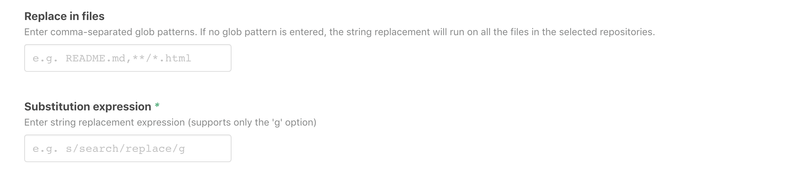
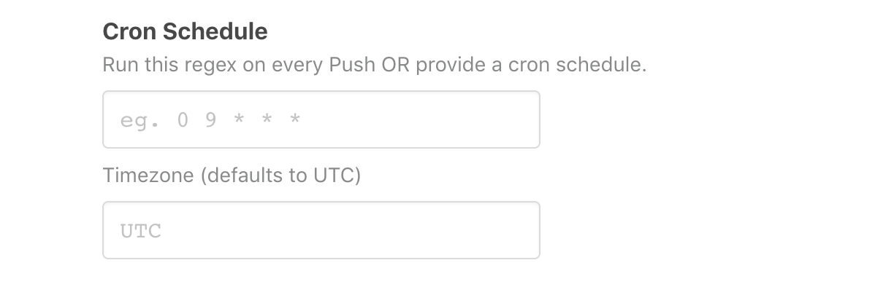
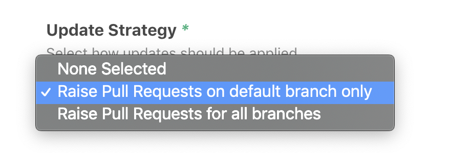

# `@atomist/string-replace-skill`

String Replace can be used to update configuration, code and text across files in all selected repositories. 
The string replacement will be run the next time there is a push to any of the selected repositories. 
If there are matches, this skill will create a pull request with the proposed changes.

<!---atomist-skill-readme:start--->

# What it's useful for

Use this skill to schedule a String Replace operation to run against any of your repos 
whenever one of the following occurs: 

1. a set of Commits is pushed to a Repository
2. a regularly scheduled event like "once per day", "every Tuesday", "first day of each month", etc.
3. when a user types `@atomist string-replace` into a Slack channel of which `@atomist` is a member

The String Replace operations are declared using regular expression.  Each configuration of this
skill can have it's own regular expression.  If the string replace operation results in a change to the 
code, the skill will raise a pull request.

# Before you get started

Connect and configure these integrations:

1. **GitHub**
2. **Slack** (optional)

This skill creates GitHub Pull Requests.
Therefore, user will need to configure a GitHub integration the skill can be enabled.  We've also
added an optional Slack Command to this skill.  If Slack is enabled, string replacements can be
run directly from Slack.

Atomist can make pull requests visible, and actionable, in Slack by 
enabling the GitHub notifications skill.  GitHub notifications are optional but the string replace skill works
great with the GitHub notifications skill.  Other skills that work well with this skill are:

* atomist/github-auto-rebase-skill
* atomist/github-auto-merge-skill
* atomist/github-branch-deletion-skill
 
# How to configure

The first thing to think about is the regular expression you want to run, and which files you want it to run on



The `expression` is required.  The `glob-pattern` is optional.  If not included, the expression will run
on all the files in the Repo.

Each configuration of this skill declares a string replace `expression`, a set of applicable repositories 
(including _all_ repositories), and whether or not the operation should run on a cron schedule, or on every change.



If a user enters a [cron expression](), the operation will run on that schedule.  Without a cron expression, the
operations runs on every `Push` to the repository.  For `Push` schedules string replace operations, the user can 
choose whether or not the operation should run on Pushes to non-default branch refs (ie only master branches).  



Cron based schedules only run on the default branch.  For many repositories, this means master only. 

## How to use this skill

Try to start with the strings you want to capture.  Perhaps you hear a request like:

> Someone should write a bot that updates the year 
> on your Clojure project's readme so projects that still work don't look old.

Create a configuration of this skill representing this requirement.  For help crafting 
and testing your regular expressions, try [this online tool](https://regex101.com/) 
and see [this guide](https://developer.mozilla.org/en-US/docs/Web/JavaScript/Guide/Regular_Expressions/Cheatsheet).

Combining capture groups and back references can be surprisingly powerful.  A yaml snake case to camel case converter like:

`s/([a-zA-Z]*?)_([a-zA-Z])/$1\U$2/g`

could be applied to all files matching the [glob patterns](https://en.wikipedia.org/wiki/Glob_(programming)) `*.yaml,*.yml` and then triggered from slack 
by typing:

```
`@atomist string-replace --configuration="Snake case → camel case for YAML"`
``` 

where `configuration` is a name of one of your skill's configurations.  This skill will only create pull requests.  It
will never add a Commit to an existing branch ref.

Use the repo filter to limit the skill to a select set of repositories.  However, useful search replace operations can
be easily shared too.  Just let the skill see a larger set of Repositories.  Some operations are useful on _all_ of your
repositories.

<!---atomist-skill-readme:end--->

---

Created by [Atomist][atomist].
Need Help?  [Join our Slack workspace][slack].

[atomist]: https://atomist.com/ (Atomist - How Teams Deliver Software)
[slack]: https://join.atomist.com/ (Atomist Community Slack) 
