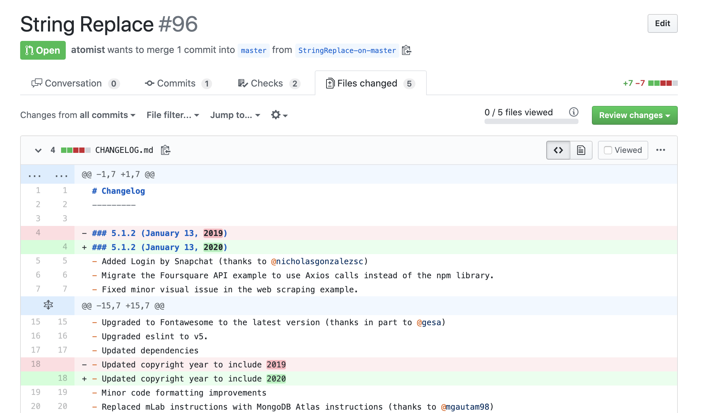

# `@atomist/string-replace-skill`

String Replace can be used to update configuration, code and text across files in all selected repositories. 
The string replacement will be run the next time there is a push to any of the selected repositories. 
If there are matches, this skill will create a pull request with the proposed changes.

<!---atomist-skill-readme:start--->

# What it's useful for

Make updates to code and configuration across your entire codebase. Automatically update files across all selected repositories based on a regular expression. Schedule the updates, run on push or run as a command via the Atomist Slack bot.

* Update configuration, code, documentation or any files in your repositories
* Automatically update READMEs in active projects to show that they are still active
* Rename packages across an entire codebase
* Update information needing periodic revision like dates, licenses, comment blocks

# Before you get started

Connect and configure these integrations:

1. **GitHub**
2. **Slack** (optional)

This skill raises pull requests. The GitHub integration must be configured in order to use this skill. At least one repository must be selected.

When the optional Slack integration is enabled, users can run String Replace directly from Slack.
 
# How to configure

1. **Select the files to scan**

    To restrict the files that this skill will run on, provide one or more 
    [glob patterns](https://en.wikipedia.org/wiki/Glob_(programming)). 
    For example, to only run on YAML files with `.yaml` or `.yml` extensions at any depth in the repository, 
    you would provide this glob pattern:
    
    `*.{yaml,yml}`
    
    
    
    The glob pattern is optional.  If not specified, the expression will run on all of the files in the selected repositories.

2. **Enter a substitution expression**

    Enter the expression to match and substitute. This will always start with `s/` and eng with `/g` which tells 
    the skill to do a *global* replacement, replacing all matches found. ( `/g` is the only option supported). 
    
    For example, to perform the snake case to camel case conversion, this substitution expression would accomplish the job:
    
    `s/([a-zA-Z]*?)_([a-zA-Z])/$1\u$2/g`
    
    For help crafting and testing your regular expressions, try [this online tool](https://regex101.com/) and 
    see [this guide](https://developer.mozilla.org/en-US/docs/Web/JavaScript/Guide/Regular_Expressions/Cheatsheet).

3. **Select branch policy**
 
    Select whether the skill should run on pushes to the default branch only, or all branches. 

    

4. **Set to run on a schedule**

    
    
    To run on a schedule, enter a [cron schedule](https://en.wikipedia.org/wiki/Cron). If no cron schedule is set, 
    the skill runs on every push to a selected repository.
    
    When run on a schedule, this skill only runs on the default branch.

5. **Determine repository scope**

    

    By default, this skill will be enabled for all repositories in all organizations you have connected.

    To restrict the organizations or specific repositories on which the skill will run, you can explicitly choose 
    organization(s) and repositories.

---

## How to use String Replace

1. **Configure the skill, enter a substitution expression, branch policy and repository scope** 

    Combining capture groups and back references in your substitution expression can be surprisingly powerful.  
    A YAML [snake case](https://en.wikipedia.org/wiki/Snake_case) to 
    [camel case](https://en.wikipedia.org/wiki/Camel_case) converter like this could be applied to all files 
    matching the [glob patterns](https://en.wikipedia.org/wiki/Glob_(programming)) `*.yaml,*.yml`

    `s/([a-zA-Z]*?)_([a-zA-Z])/$1\U$2/g`
    
    Use the repository selector to limit the skill to a select set of repositories.  However, useful search replace 
    operations can be easily shared too.  Just let the skill see a larger set of repositories.  Some operations 
    are useful on _all_ of your repositories.


2. **The skill runs on new pushes to a repository or your defined schedule**

    
    If any files were changed, a pull request will be raised with the changes. 
    This skill will never commit directly to an existing branch.
    
    

3. **Run a string replacement from Slack**

    

    Trigger a string replacement from a Slack channel by running

    ```
    @atomist string-replace --configuration="Snake case to camel case for YAML"
    ``` 

    where `configuration` is the name of a saved String Replace skill configuration that you created.
    In this case, the skill configuration name is `Snake case to camel case for YAML`.
    
    

4. **Don't be afraid to roll out that big naming change or deprecate that library!**

    To create feature requests or bug reports, create an 
    [issue in the repository for this skill](https://github.com/atomist-skills/string-replace-skill/issues). 
    See the [code](https://github.com/atomist-skills/string-replace-skill) for the skill.

<!---atomist-skill-readme:end--->

---

Created by [Atomist][atomist].
Need Help?  [Join our Slack workspace][slack].

[atomist]: https://atomist.com/ (Atomist - How Teams Deliver Software)
[slack]: https://join.atomist.com/ (Atomist Community Slack) 
